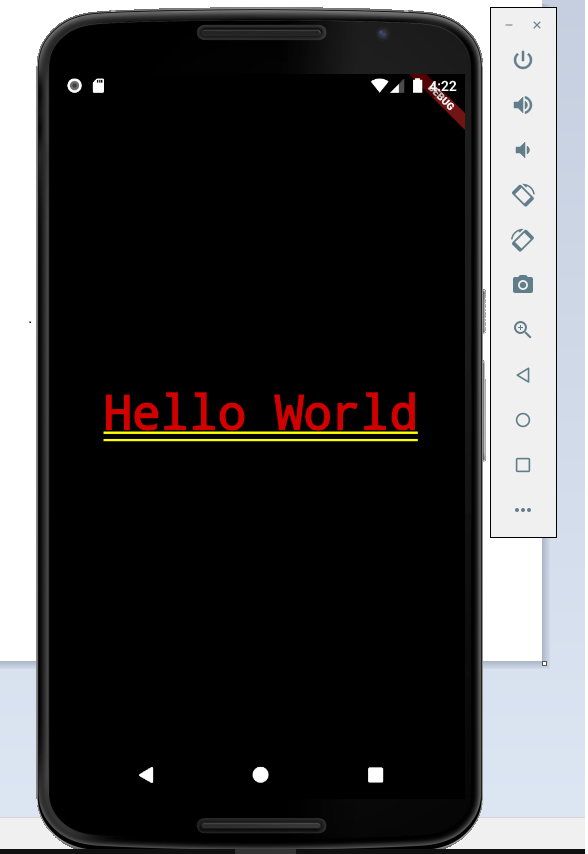

# Flutter

 A tool kit that makes it easy for developers to design beautiful interfaces for all sorts of screen size and devices. It comes with a whole bunch of pre-built widgets that makes it easy to lay out your app so straightforward things such as laying out your app with rows or with columns or stacks.There are loads of different widget which are pre-built and you can customize it to own liking with few lines of code.

**IT CAN BE DEPLOYED EVERYWHERE**

## Why Flutter ?

- ##### One CodeBase To Rule Them All.

- ##### Language Required :- DART

- ##### A simple and flexible layout system.

- ##### Split Second Reload

- ##### Access to Original Source Code

  

## Pre-Requisite

##### 1. Android Studio 

##### 2. Flutter

##### 3. Emulator or Physical Device

### Let's Get Started

We are going to run a blank material app that will be something to confirms just a material design pattern. Material design pattern is just a design style or a concept that is created by Google .

Every thing we design will be like a widget tree. So material app will be the base widget . Anything we add it , it will inside material widget.

```dart
import 'package:flutter/material.dart';

void main() => runApp(
      MaterialApp(
        home: Center(
          child: Text('Hello World'),
        ),
      ),
    );
```

> The text widget is used for displaying text and center widget is for aligning the text.

You might observe you will get the code in a single line that can be helped by Reformat code with dartfmt but only when you help him. So after every bracket close add a comma.

We can replace => with {}

```dart
import 'package:flutter/material.dart';

void main() {
 runApp(
      MaterialApp(
        home: Center(
          child: Text('Hello World'),
        ),
      ),
    );
}    
```

## Scaffold Class

```dart
import 'package:flutter/material.dart';

void main() {
  runApp(
    MaterialApp(
      home: Scaffold(
        backgroundColor: Colors.orangeAccent,
        appBar: AppBar(
          title: Text('Hello World'),
          backgroundColor: Colors.orange,
        ),
        body: Image(
            image:NetworkImage('https://hsj.com.np/uploads/0000/386/2020/05/15/blog-test.jpg')
        ),
      ),
    ),
  );
}

```

#### To Center the Image

```dart
import 'package:flutter/material.dart';

void main() {
  runApp(
    MaterialApp(
      home: Scaffold(
        backgroundColor: Colors.orangeAccent,
        appBar: AppBar(
          title: Text('Hello World'),
          backgroundColor: Colors.orange,
        ),
        body: Center(
          child: Image(
              image:NetworkImage('https://hsj.com.np/uploads/0000/386/2020/05/15/blog-test.jpg')
          ),
        ),
      ),
    ),
  );
}
```

### Let's Sum Up the Things Done

- A new app structure using the Scaffold Class
- Set the Background Color
- A title
- Adding an image using an URL
- Centering the Text and Image

```dart
import 'package:flutter/material.dart';

void main() {
  runApp(
    MaterialApp(
      home: Scaffold(
        backgroundColor: Colors.orangeAccent,
        appBar: AppBar(
          title: Center(child: Text('Hello World')),
          backgroundColor: Colors.orange,
        ),
        body: Center(
          child: Image(
              image:NetworkImage('https://hsj.com.np/uploads/0000/386/2020/05/15/blog-test.jpg')
          ),
        ),
      ),
    ),
  );
}
```

## To Add Local Images

- Create an directory named as images section.

- Go the pubspec.yaml file and uncomment the assets lines of code

- Change the name of images to your local image name placed in image folder.

  > YAML :- YAML Ain't Markup Language

## To Add Icons

Select the image and [visit](https://appicon.co/) . Press the download button. You will get a zip.

Android

- AndroidStudioProjects\flutter_app\android\app\src\main

IOS

- AndroidStudioProjects\flutter_app\ios\Runner\Assets.xcassets\AppIcon.appiconset

